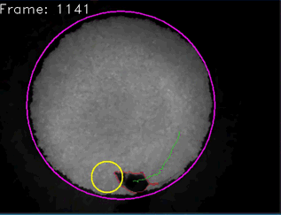

=================================
Welcome to Pyper's documentation!
=================================

.. include:: v2_changes.rst

.. include:: introduction.rst

=======
Example
=======

    
    An example of the tracking software in action.
    
    The yellow square at the bottom right lights up when the mouse enters the
    predefined Region Of Interest (the yellow circle). This behaviour can
    easily be overwritten by the user by specifying a different function.
    

=============
Documentation
=============
.. toctree::
   :maxdepth: 2
   
   installation
   getting_started
   usage
   api
   troubleshooting
   contributing

==================
Indices and tables
==================

* :ref:`genindex`
* :ref:`modindex`
* :ref:`search`

