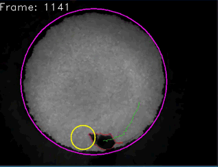

.. Pyper documentation master file, created by
   sphinx-quickstart on Tue Jun  2 19:41:30 2015.
   You can adapt this file completely to your liking, but it should at least
   contain the root `toctree` directive.

=================================
Welcome to Pyper's documentation!
=================================

News : Pyper v2 is here.
------------------------

This new version draws on user feedback to implement most of the requested features.

What's new:
    -  New goodies:
        - A new 'transcoding' tab to fix broken videos, extract parts of and scale the video.
        - A new ROI system with the ability to select the shape of the ROI, and it's color
        - New ROI functions: measure video values and spatially restrict tracking.
        - A new plugin system for tracking methods. Also adds pupil tracking.
    - Behind the scenes:
        - Refactors python code to PEP8 compliance.
        - Major refactoring of the GUI code.
    - Various bug fixes.

Introduction
------------

This program allows the tracking of specimen (e.g. a mouse, a rat ...) in an 
open field maze from pre-recorded videos or from a live feed. The live stream 
of frames can be generated from a usb camera or from the camera (normal or NoIR)
of the Raspberry Pi. On the Raspberry Pi, a subclass of the standard PiCamera 
object is used to speed-up video acquisition and online processing.

The combination of recording and online position tracking allows the definition
of complex behavioural experiment as the program can send a TTL pulse to an
other computer upon detecting the mouse (for example: in a certain region of 
space).

The modules can be used interactively from the python interpreter or through
the provided interfaces.
This program provides both a command line interface and a graphical user
interface. For the CLI, the defaults are saved to a user specific preference
file.

Some basic analysis of the extracted position data is also available.
Two classes are also supplied for viewing of the recorded videos or transcoding.

Please see the instructions below for installation and usage.

=======
Example
=======

    
    An example of the tracking software in action.
    
    The yellow square at the bottom right lights up when the mouse enters the
    predefined Region Of Interest (the yellow circle). This behaviour can
    easily be overwritten by the user by specifying a different function.
    

=============
Documentation
=============

.. toctree::
   :maxdepth: 2
   
   installation
   gettingStarted
   usage
   api
   troubleShooting

==================
Indices and tables
==================

* :ref:`genindex`
* :ref:`modindex`
* :ref:`search`

