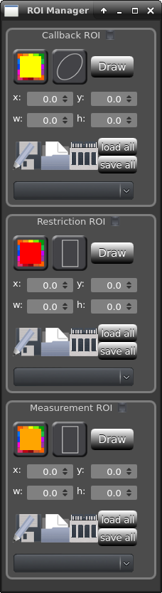

**Roi manager:**
    .. versionadded:: 2.0
        A full ROI manager has been added to pyper to allow saving/loading of ROIs, arbitrary shapes and various
        functions.

    You can start the ROI manager by clicking the yellow circle icon at the bottom of the interface.
    This will popup a new window that will allow you to select 3 types of ROI:

    *Tracking*
        These ROi are used to trigger a callback function of your choice (popup a cyan square by default)
        whenever the center of mass of the tracked specimen enters the ROI.

    *Restriction*
        These ROI allow you to restrict the tracking to objects fully enclosed (i.e. all of the points of
        their contour) in the ROI.

    *Measure*
        These ROI will measure some parameter of the image within the ROI (the average brightness by default)
        for each frame.

    You can modify the shape and color of these ROIs at will. Only ROIs marked *active* will be taken into
    account during tracking.

