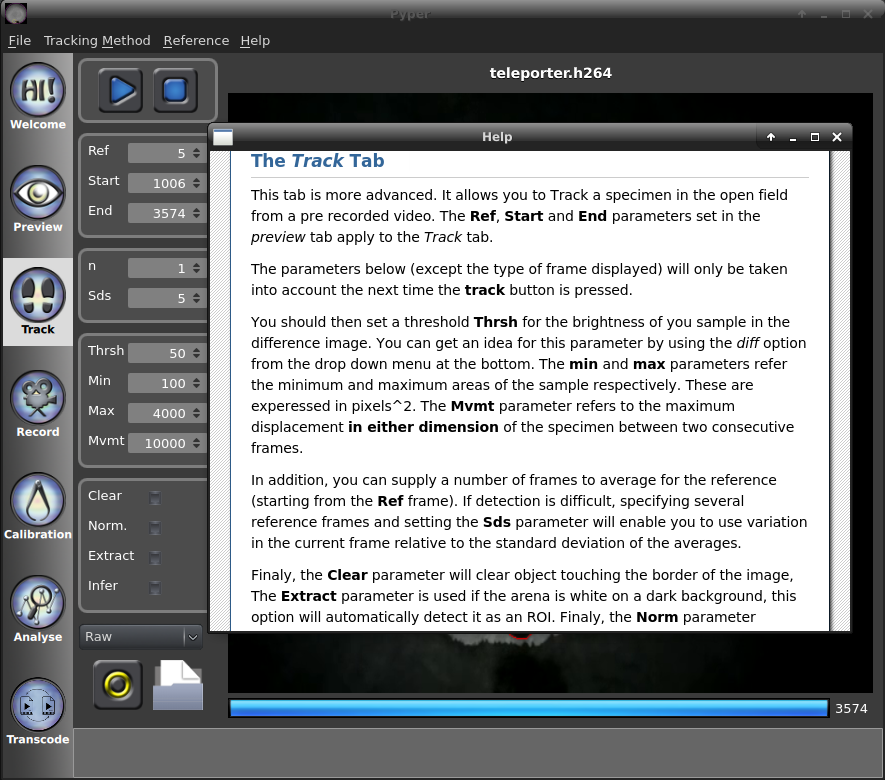

=====
Usage
=====
This software can be used in different ways.
You can use the graphical interface, the command line interface (from the terminal)
or import the modules from a python interpreter.

Using the Graphical interface:
------------------------------
To use the Graphical interface, start a terminal window and then:

Change your working directory to that of the source of the program.
This must fit your installation folder. For example if you downloaded pyper on the desktop:

.. code-block:: bash
    
    cd ~/Desktop/pyper
    
Then actually launch the program:

.. code-block:: bash

    python pyper/tracking_gui.py
    

You are greeted by the *welcome* tab. To navigate between functions, please select a corresponding tab on the left.
The *Preview* and *Track* tabs require a video to analyse to be loaded.
To do so, use the *file* menu or the standard *open file* shortcut on your platform.

The record tab will pop up without a camera attached but will require you to select a destination path
for the recorded video to start the recording.

The *analysis* tab requires to have performed the tracking or recording step before use.
It can however be used while the software is tracking.

Getting help
^^^^^^^^^^^^
When using the graphical interface, hovering over buttons and other elements should display tooltips explaining
what these do. Also, the help menu brings you to the section of this manual corresponding to the tab you
are currently using. See below for an example of the help for the *Track* tab.

The *Preview* tab
^^^^^^^^^^^^^^^^^
The preview tab enables you to have a look at a downscaled version of your video to select your start and end point
for the analysis as well as the frame that will serve as a reference.

.. warning:: As not all video will allow seeking, the preview is achieved by loading a downscaled version of the
    video in memory before playing it. The consequence is that the size of the video you will be able to preview
    depends on the amount of memory on you computer. THIS DOES NOT AFFECT THE TRACKING WHICH LOADS THE VIDEO ONE
    FRAME AT A TIME.

The reference frame must appear before the data frames or be loaded from an image file.
You can navigate in your video using the controls on the left of the progress bar at the bottom.
Then, when on the desired frame select **Ref**, **Start** or **End** accordingly.
An end of -1 corresponds to the end of the file.
It is advised to select a frame that is not the first one (e.g. 5 onwards) for the **Ref** as the camera may take a few
frames to auto-adjust some parameters and the video CODEC may also alter the very first frames.

The *Track* Tab
^^^^^^^^^^^^^^^
This tab is more advanced. It allows you to Track a specimen in a pre recorded video.
The tracking method (i.e. the processing of the video to extract the tracked object) can be controlled by
a plugin system. By default, two plugins are available under the "Tracking Method" menu: "open field" and
"pupil tracking". You can easily add your own method by clicking "Add custom" and overwriting the class name
as well as the methods used to extract information.

The **Ref**, **Start** and **End** parameters set in the *preview* tab apply to the *Track* tab.

You should then set a threshold **Thrsh** for the brightness of you sample in the difference image.
You can get an idea for this parameter by using the *diff* option from the drop down menu at the bottom.
The **min** and **max** parameters refer the minimum and maximum areas of the sample respectively.
These are expressed in pixels^2. The **Mvmt** parameter refers to the maximum displacement **in either dimension**
of the specimen between two consecutive frames.

In addition, you can supply a number of frames to average for the reference (starting from the **Ref** frame).
If detection is difficult, specifying several reference frames and setting the **Sds** parameter will enable you
to use variation in the current frame relative to the standard deviation of the averages.

* The **Clear** option will clear object touching the border of the image.
* The **Extract** parameter is used if the arena is white on a dark background,
  this option will automatically detect it as an ROI.
* The **Norm** option removes the slight variations in global brightness between frames.
  This control normalises each frame to the brightness of the reference.
* The **Infer** option allows you to assume that the object is still in the same location if the tracking is lost.
 
The default detection parameter should be appropriate for the example videos.
Once you have found detection parameters that work well for you, you can set these as defaults
by selecting the menu entry *file* > *Save config to defaults*.

The drop down menu allows you to select between the type of image (level of processing) you want to display.
Please note that this option only applies to the portion of the recording that is being actively tracked,
the ignored portion will just be displayed as the source (i.e. *raw*).

.. include:: roi_manager.rst

.. include:: customising_tracking.rst

If you cannot detect your sample successfully, please refer to the :doc:`troubleshooting` section.

The *Record* Tab
^^^^^^^^^^^^^^^^
This tab essentially reproduces the behaviour of the *Track* tab but for videos that are currently
being recorded (through a USB or FireWire camera for example).
This is most useful for closed loops experiments as the ROI manager will allow you to define the behaviour of
external equipment based on the live tracking results.
Before starting you must supply a destination path to save the video.
The extension of the output path will determine the format.
The available formats will dependent on the codecs available to FFMPEG in you installation.
In tests, best results (highest likelihood of having the CODECS working) were obtained
with the .avi and .mpg containers.

The *Calibration* tab
^^^^^^^^^^^^^^^^^^^^^
This menu computes the parameters of the lens used to acquire the videos. Once these parameters are calculated,
they will be automatically used to *undistort* the images in the *Track* and the *Record* tabs.
To use this functionality, you must provide a folder containing a series (e.g. 10) of images acquired
with the same lens and parameters as the video and containing a reference chessboard.
For each image, the location and angle of the pattern must be altered to provide a good sampling of the space.
Also, the whole pattern must reside within the image as it will be automatically detected.
A printable template which will work with the default parameters can be found at
http://docs.opencv.org/2.4/_downloads/pattern.png. Please make sure that the pattern is printed on a flat and
rigid surface.
Once the folder is selected, press **Calibrate** and wait for the calibration to finish.
Once done, the controls will become available and allow you to browse through the images used for calibration,
the images with the features drawn and the *undistorted* images. You can also save the camera matrix for reference.
In the future, it is planned to have controls to load a calibration file from the *Track* and *Record* tabs.

The *Analyse* tab
^^^^^^^^^^^^^^^^^
This tab provides simple analysis and graphing features as well as the ability to save the list of coordinates.

#. First select the checkbox that corresponds to the tab you want to analyse.
#. Then, click **Update** and you can finally save your coordinates and plot graphs
   of distance made by the specimen between frames and change of directions at each frame.
#. To save the graphs, right click on them and a menu will prompt you for a destination path.

The *Transcoding* tab
^^^^^^^^^^^^^^^^^^^^^
This tab allows you to change the file format of your video, extract parts of it and scale it.

#. Select a source video with the first file menu.
#. Select a destination video file with the second file menu.
#. Select the start and end frame within the video. As with the other tabs, and end of -1 indicates the whole range.
#. Select the scaling factor. It defaults to a scaling of 1 (100%) in each dimension.
#. If you want to extract a region of the video, draw a rectangular ROI on the video as desired.
#. Specify a CODEC for the output video.

.. note:: Not all codecs will work on all platforms. This depends on your FFMPEG installation.

.. warning:: Currently, other ROI shapes are available in the ROI manager in this tab but you should make sure
    that you only select the rectangle ROI shape.

Using the Command Line Interface:
---------------------------------

.. automodule:: pyper.cli.tracking_cli

.. only :: isSystem

    .. argparse::
        :module: pyper.cli.tracking_cli
        :func: get_parser
        :prog: tracking_cli
